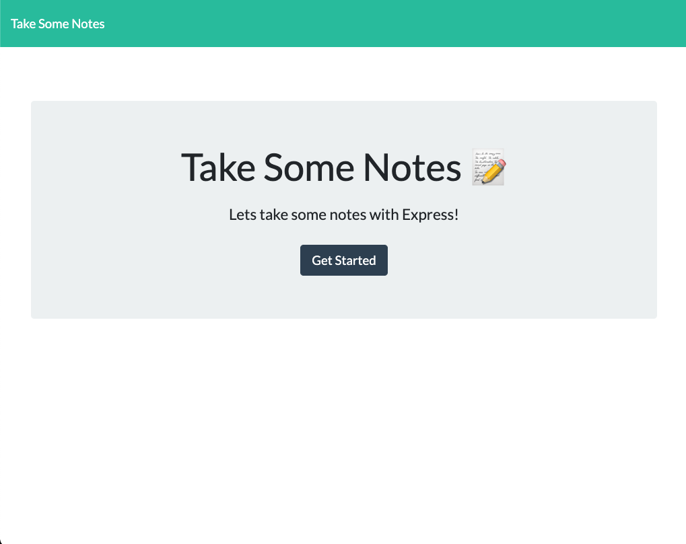
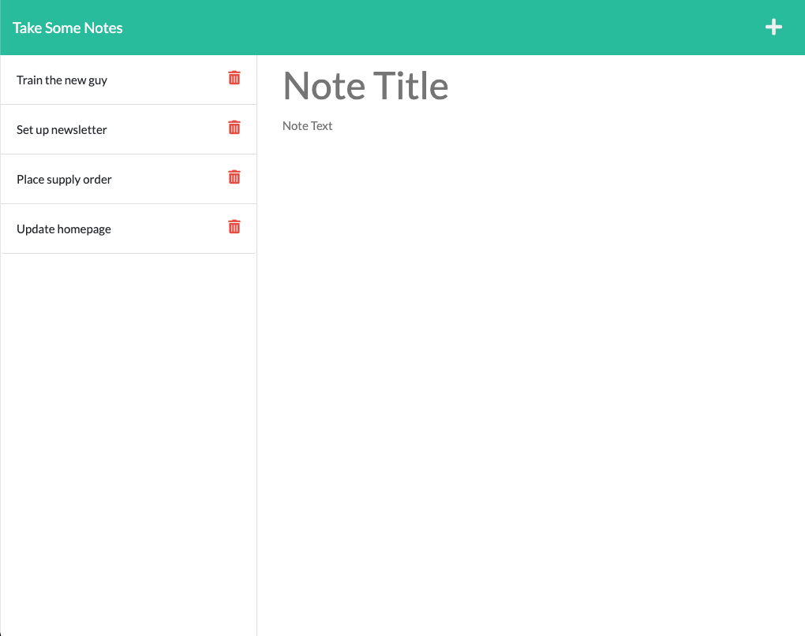

# take-some-notes

<br />

## Table of Contents

- [Description](#description)
- [User Story](#user-story)
- [Installation](#installation)
- [Deployed](#deployed)
- [License](#license)
- [Demo](#demo)
- [Criteria](#acceptance-criteria)
- [Collaboration](#collaboration)

<br />

## Description

Take Some Notes is used to write & save your notes! Deployed to Heroku, with Express.js built back end, this app will save notes by title; storing, retrieving, and deleting data on a JSON file.

<br />

## User Story

```
AS A small business owner
I WANT to be able to write and save notes
SO THAT I can organize my thoughts and keep track of tasks I need to complete
```

<br />

## Installation

Application uses [Express](https://expressjs.com/) back end, and will run in terminal with:

```
npm start
```

Command-line to initialize server at:

```
localhost:3001
```

<br />

## Deployed

[](https://www.heroku.com/)  
[Take Some Notes App on Heroku](https://take--some--notes.herokuapp.com//)

<br />
<br />

## License

[](https://choosealicense.com/licenses/isc/)  
Copyright (c) David Dyer [2021]

<br />

## Demo




<br />

## Criteria

```

When opening app, landing page provides link to notes page.

Clicking link leads to notes page with existing notes at left column.

Empty fields at right to enter note title & text.

After entering note title & text, save icon appears in top nav.

When clicking save icon, new note appears at left column.

When selecting any existing note, text detail appears at right column.

Plus sign clears fields to enter new note.

Trash can removes note from storage.

```

<br />

## Collaboration

Development efforts most often include guidance from Jedi Master:
**Chris Champness**

<a href= "https://github.com/CChampness"></a>

Working alongside the likes of:
**Olsen Ogouchi**

<a href="https://github.com/Chrisolsen1993"></a>

<br />

**Reporting issues**:
Contact [djdyer](https://www.github.com/djdyer) to report bugs.

<br />

**Contributions**:
Clone branch, submit pull request for review after completing any improvements.

<br />
<br />
<br />
Thanks for visiting!

👾
